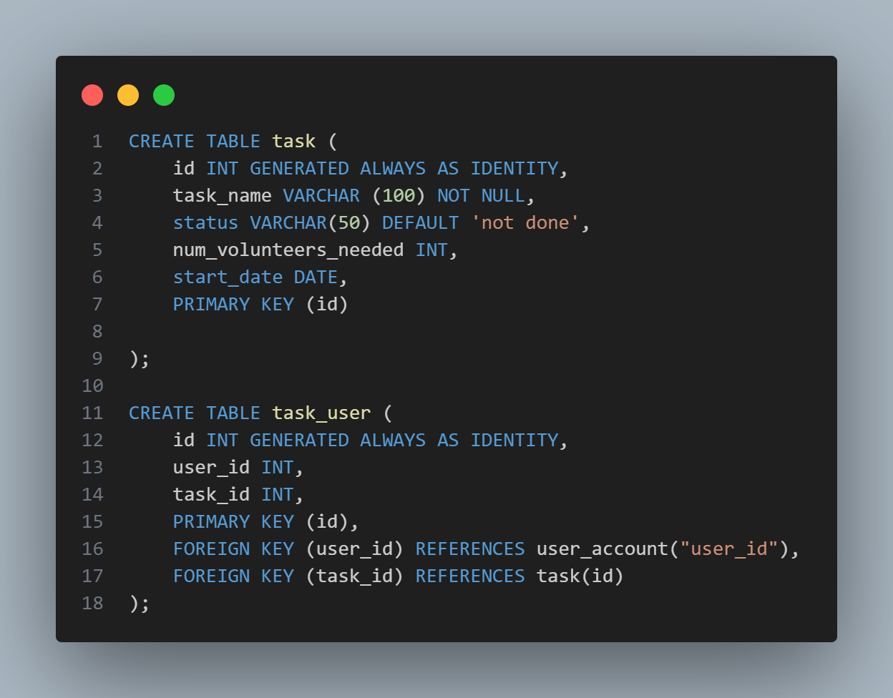
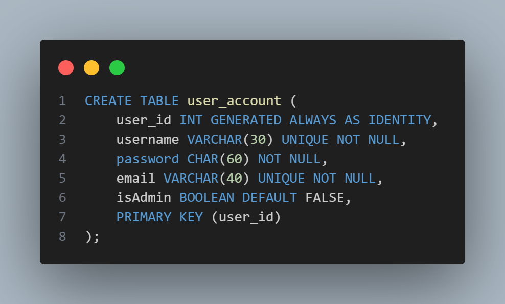
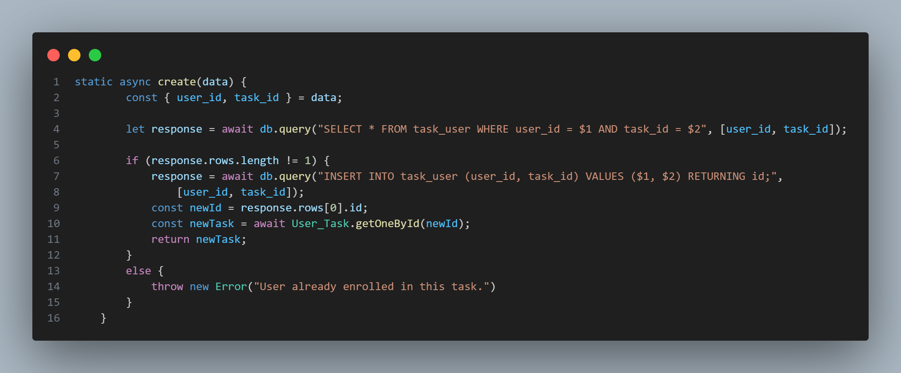

# Give a Hand Back End

## Project Description
We have developed this app to help solve the issue of redundant talent and to help the locals keep track of pending serevices. Admins can log in and update posts on the news page, tasks on the services page and see the number of volunteers. Volunteers can create an account and enroll themselves on different tasks of their choice. 

## Installation and Usage

- Open the terminal
- Make sure that you have Docker installed.
- Clone the repo by typing in the terminal: 
```bash
    git clone git@github.com:asiek728/Reddy_2_1_Back_End.git 
```

- Change your directory to the repo:
```bash
    cd path_to_your_cloned_repo_folder
```
- Start the database service: 
 ```bash
    docker compose up -d
 ```
  Ensure you are inside the folder with the docker-compose.yaml file. If you want to stop the docker, type:
  ```bash
    docker compose down
  ``` 
- For instaling modules write in the terminal: 
```bash
    npm install 
```
- Create .env file inside the repo folder by typing in the terminal: 
```bash
    touch .env
```
- Inside the .env file declare:
```js
    DB_URL=postgres://username:password:5432/db_name   //replace username, password and dbname with your actual credentials  
    PORT=
    BCRYPT_SALT_ROUNDS= 
```

- For setting the data base type in the terminal: 
```bash
    npm run setup-db
```
- to run the app type 
```bash
    npm run dev

```
The app will run on the port specified in the `.env` file: `http://localhost:PORT_from_env/`  

## Technologies used on Back End
- Javascript
- express
- docker
- elephantSQL (during production)

**Testing:**
- jest
- supertest

## Wins
Successfully implemented authentication, so only admins are able to access the admin page and update posts

## Challenges
We struggled to get a lot of our tests to pass


## Screenshots of significant code




